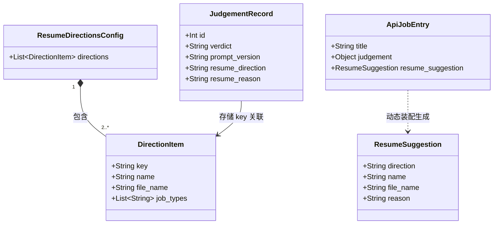

# Data Model: 判断时建议投哪份简历 (006)

> **2026-09-29 修订**：简历方向不再放在仓库配置文件 `resume_directions.json`，改为设置页"我的简历"（本机数据库 `resume_slots`，编号 1–3，只发编号与适合的岗位类型）；从严行业改为设置页勾选（`strict_industry_selection`，迁移 v7）。本文件中涉及 `resume_directions.json` 与方向代号（`ai_ops` 等）的设计已被 `tasks.md`"2026-09-29 修订"一节取代，以该节与 `spec.md` 为准。


**Feature**: `006-resume-suggestion` | **Date**: 2026-09-29

本功能在现有数据模型（user_version 6）基础上扩展 `judgements` 表存储列，引入本地简历方向配置模型，并在服务端岗位条目与前端视图状态中新增简历建议实体。

---

## 一、实体变更概览



---

## 二、本地实体：简历方向配置（`resume_directions.json`）

存放于本机 `src/jet/llm/prompts/resume_directions.json`，供后端模型提示词组装与 API 响应装配使用。

### 1. JSON 结构定义

```json
{
  "directions": [
    {
      "key": "ai_ops",
      "name": "AI / 运营",
      "file_name": "简历A.pdf",
      "job_types": [
        "AI 产品运营",
        "内容运营",
        "平台和用户运营",
        "AIGC",
        "AI 训练师"
      ]
    },
    {
      "key": "data_support",
      "name": "数据 / 技术支持",
      "file_name": "简历B.pdf",
      "job_types": [
        "数据分析",
        "数据管理",
        "临床数据",
        "实施",
        "技术支持",
        "数据标注和质检"
      ]
    },
    {
      "key": "animal_life",
      "name": "动物 / 生命科学",
      "file_name": "简历C.pdf",
      "job_types": [
        "宠物",
        "实验动物和动物手术支持",
        "生物医药 / CRO",
        "农牧科技企业的技术或数据岗"
      ]
    }
  ]
}
```

### 2. 字段规范与校验约束

| 字段 | 类型 | 必需 | 约束与说明 | 是否发往大模型 |
|---|---|---|---|---|
| `key` | 字符串 | 是 | 唯一英文代号（如 `ai_ops`），小写字母与下划线组成 | **是**（作为代号） |
| `name` | 字符串 | 是 | 方向中文名（如 `AI / 运营`），去除首尾空白后非空 | **是**（方向名称） |
| `file_name` | 字符串 | 是 | 本机简历文件名（如 `简历A.pdf`），用于前端显示 | **否（绝不发送）** |
| `job_types` | 字符串列表 | 是 | 适合的岗位类型清单，至少 1 项非空字符串 | **是**（说明文字） |

### 3. 加载与容错行为（`src/jet/domain/resume.py`）

- **文件缺失 / 格式错误**：若文件不存在、JSON 语法错误、根节点不是 dict、`directions` 不是 list，记录警告日志并返回空列表 `[]`。
- **数量下限约束**：若合法方向数 $< 2$，视为不可做比较决策，记录警告日志并返回空列表 `[]`。
- **去空与去重**：`key` 必须唯一，后出现的重复 `key` 被丢弃；空字段项被忽略。

---

## 三、存储模型变更：`judgements` 表扩展

在现有 `judgements` 表中新增 2 列，记录大模型在同一次判断中给出的简历方向代号与理由。

### 1. DDL 变更（`src/jet/db/schema.sql`）

```sql
CREATE TABLE IF NOT EXISTS judgements (
    id INTEGER PRIMARY KEY AUTOINCREMENT,
    user_id TEXT NOT NULL,
    job_id INTEGER NOT NULL,
    job_version_id INTEGER NOT NULL,
    profile_id INTEGER NOT NULL,
    status TEXT NOT NULL CHECK(status IN ('queued', 'running', 'done', 'failed', 'quota_exhausted', 'interrupted')),
    verdict TEXT CHECK(verdict IS NULL OR verdict IN ('fit', 'unsure', 'unfit', 'apply', 'try', 'check', 'skip')),
    source TEXT CHECK(source IS NULL OR source IN ('rule', 'llm')),
    reasons TEXT,
    prompt_version TEXT NOT NULL DEFAULT 'v6',
    engine TEXT,
    facts TEXT,
    derivation TEXT,
    verdict_reason TEXT,
    hr_questions TEXT,
    review TEXT,
    rule_result TEXT NOT NULL,
    error TEXT,
    created_at TEXT NOT NULL,
    finished_at TEXT,
    superseded_by INTEGER,
    origin TEXT,
    resume_direction TEXT,
    resume_reason TEXT,
    FOREIGN KEY (user_id) REFERENCES users(id),
    FOREIGN KEY (job_id) REFERENCES jobs(id),
    FOREIGN KEY (job_version_id) REFERENCES job_versions(id),
    FOREIGN KEY (profile_id) REFERENCES profiles(id),
    FOREIGN KEY (superseded_by) REFERENCES judgements(id) DEFERRABLE INITIALLY DEFERRED
);
```

### 2. 动态迁移保证（`src/jet/db/store.py`）

通过既有 `_ensure_current_schema` 机制执行幂等添加，无需升 `user_version`（保持为 6）：

```python
cols = [r[1] for r in conn.execute("PRAGMA table_info(judgements)").fetchall()]
if "resume_direction" not in cols:
    conn.execute("ALTER TABLE judgements ADD COLUMN resume_direction TEXT")
if "resume_reason" not in cols:
    conn.execute("ALTER TABLE judgements ADD COLUMN resume_reason TEXT")
```

### 3. 列规范与写入行为矩阵

| 字段 | 类型 | 可为空 | 存储说明 |
|---|---|---|---|
| `resume_direction` | TEXT | 是 | 模型返回的方向代号（必须严格为当前配置中的 `key` 之一） |
| `resume_reason` | TEXT | 是 | 模型返回的一句话理由（非空字符串，入库前截断至最多 40 字符） |

#### 写入场景行为：

| 判断场景 | `prompt_version` | `resume_direction` 存入值 | `resume_reason` 存入值 |
|---|---|---|---|
| **v6 大模型成功且输出合规** | `"v6"` | 校验合法的 `key`（如 `"ai_ops"`） | 截断后的一句话理由（$\le 40$ 字） |
| **v6 大模型返回非法 key 或非空串** | `"v6"` | `NULL` | `NULL` |
| **v6 大模型输出缺失 resume_suggestion** | `"v6"` | `NULL` | `NULL` |
| **规则直接排除（无需模型）** | `"rule"` | `NULL` | `NULL` |
| **已有历史判断（升级前 v5 及更早）** | `"v5"` 等 | `NULL` | `NULL` |
| **判断失败 / 额度耗尽** | `"v6"` | `NULL` | `NULL` |

---

## 四、API 响应数据模型：`resume_suggestion`

服务端在组装规范岗位条目（Canonical `_job_entry`，见 `src/jet/domain/judgements.py:to_api`）时，动态装配该字段。

### 1. 结构规范

```python
{
    "direction": str,     # 方向代号，如 "ai_ops"
    "name": str,          # 方向名称，如 "AI / 运营"
    "file_name": str,     # 简历文件名，如 "简历A.pdf"
    "reason": str         # 一句话理由，如 "岗位为AI提示词工程与用户运营混合职责，契合该方向"
}
```

### 2. 运行时动态解析规则

在 `to_api` 执行时，由本机根据当前 `resume_directions.json` 动态映射：
1. 读取判断行的 `resume_direction` 与 `resume_reason`；
2. 若任一列为 `NULL` 或空串，`resume_suggestion` 设为 `None`（JSON 输出 `null`）；
3. 若 `resume_direction` 不存在于当前配置的 `directions` 列表中（例如用户事后在配置文件中删除了该方向），回退设为 `None`；
4. 若方向匹配成功，将配置文件中该项的 `name` 与 `file_name` 与库中存储的 `reason` 结合返回。

---

## 五、前端状态模型（插件端）

### 1. `ChatJobStatus` 扩展字段（`extension/src/chat-view.js`）

侧边栏当前岗位状态格式化函数 `formatChatJobStatus` 挂载以下字段：

```javascript
{
    platform_job_id: string,
    in_library: boolean,
    title: string,
    company_name: string,
    verdict_label: string | null,
    verdict_tone: string,
    summary_reason: string | null,
    hr_note: string | null,
    my_status: object | null,
    stale: boolean,
    judged_at: string | null,
    notice: string | null,
    // 006 新增字段
    resume_suggestion: {
        direction: string,
        name: string,
        file_name: string,
        reason: string
    } | null
}
```

### 2. 聊天页侧边栏高亮提醒状态模型（`extension/src/sidepanel.js`）

在侧边栏内存中维护会话级别的卡片状态：

```javascript
{
    // 是否检测到 HR 发送的简历请求卡片 (body_type == 7 且 !is_self)
    has_hr_resume_request: boolean,

    // 当前是否应在侧边栏顶部醒目高亮展示简历建议
    // 判定条件：has_hr_resume_request === true && resume_suggestion !== null && verdict !== 'skip'
    should_highlight_resume: boolean,

    // 是否提示用户重新判断
    // 判定条件：has_hr_resume_request === true && resume_suggestion === null && in_library === true && verdict_label !== null
    should_prompt_rejudge: boolean
}
```

#### 状态生命周期：
- **聊天切换触发**：`chat_switched` 时，`has_hr_resume_request` 立即重置为 `false`；
- **消息读取完成**：`read_chat_page` 完成后，依据最新提取的 `messages` 重新计算并触发 DOM 局部渲染；
- **会话切走**：清理所有会话级提示，防止上一会话的高亮状态残留到新会话。
