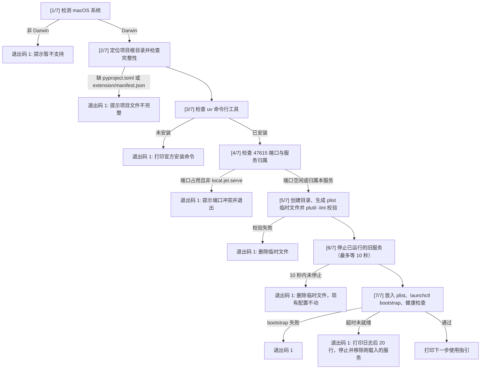

# Script Contracts: macOS 安装与卸载脚本规范

**Feature**: `007-friend-install`
**Files**: `scripts/install-macos.sh`, `scripts/uninstall-macos.sh`
**Shell**: `bash` (严格设置 `set -euo pipefail`)
**Privileges**: **绝对不使用 sudo**（用户空间进程，LaunchAgent 安装在 `~/Library/LaunchAgents`）

---

## 1. 安装脚本规范 (`scripts/install-macos.sh`)

### 1.1 执行步骤与契约

脚本按 `[1/7]` 到 `[7/7]` 打印进度（2026-10-05 按脚本实际行为更新）。



### 1.2 逐步详细说明

#### [1/7] 检测操作系统
- **检查命令**：`uname -s`
- **契约**：必须等于 `"Darwin"`。
- **失败输出**：
  ```text
  [Jet] 错误：本一键安装脚本仅支持 macOS 系统（检测到系统为 <uname>）。
  Windows/Linux 暂不支持一键安装脚本。
  ```
- **退出码**：`1`

#### [2/7] 定位项目根目录并检查完整性
- **契约**：
  通过 `SCRIPT_DIR="$(cd "$(dirname "${BASH_SOURCE[0]}")" && pwd)"` 与 `PROJECT_ROOT="$(cd "${SCRIPT_DIR}/.." && pwd)"` 定位；
  所有变量引用必须使用双引号包裹，保证路径包含空格时正常运行。
  项目根目录下缺少 `pyproject.toml` 或 `extension/manifest.json` 时报错退出。
- **退出码**：`1`

#### [3/7] 检查 `uv`
- **检查命令**：`command -v uv`
- **契约**：若未找到 `uv`，**绝不擅自自动安装任何软件**。
- **失败输出**：
  ```text
  [Jet] 错误：未检测到 uv 工具（高速 Python 包管理器）。
  请使用以下官方推荐命令安装 uv 后再运行本脚本（绝不自动安装）：
      curl -LsSf https://astral.sh/uv/install.sh | sh
  或使用 Homebrew 安装：
      brew install uv
  更多说明参见官方文档：https://docs.astral.sh/uv/
  安装完成后，请关闭并重新打开终端再运行本脚本。
  ```
- **退出码**：`1`

#### [4/7] 检查端口 47615 与服务归属
- **契约**：
  使用 `curl -s --max-time 2 http://127.0.0.1:47615/v1/health` 检查端口连通性。
  若端口有响应：
  - 检查 launchd 中是否运行了 `local.jet.serve`：
    `launchctl print "gui/$(id -u)/local.jet.serve" >/dev/null 2>&1`
  - 若正在运行，说明是之前脚本安装的旧实例，属于合法自更新，继续执行。
  - 若未在运行，说明端口被其他服务（如前台终端运行的 `jet serve` 或其他 Label 的 LaunchAgent）占用。**脚本绝不误杀其他进程**。
- **冲突输出**：
  ```text
  [Jet] 错误：端口 47615 已被其他服务占用（可能是另一套 Jet 服务或终端前台进程）。
  本脚本不会修改或停止它。请先确认并停止占用端口 47615 的程序后再重试安装。
  ```
- **退出码**：`1`

#### [5/7] 生成 LaunchAgent 配置并校验
- **创建目录**：`mkdir -p "$HOME/Library/Logs/jet" "$HOME/Library/LaunchAgents"`
- **先写入临时文件**：`$HOME/Library/LaunchAgents/local.jet.serve.plist.tmp.<pid>`，路径中的 `&`、`<`、`>` 做 XML 转义。
- **注入内容**：
  - `Label`: `local.jet.serve`
  - `ProgramArguments`: `[ "${UV_BIN}", "run", "--frozen", "jet", "serve" ]`
  - `WorkingDirectory`: `"${PROJECT_ROOT}"`
  - `EnvironmentVariables` 中的 `PATH`: `"${UV_DIR}:/usr/local/bin:/opt/homebrew/bin:/usr/bin:/bin"`
  - `RunAtLoad`: `true`
  - `KeepAlive.SuccessfulExit`: `false`
  - `ThrottleInterval`: `10`
  - `StandardOutPath` 与 `StandardErrorPath`: `"${HOME}/Library/Logs/jet/serve.log"`
- **语法校验**：`plutil -lint <临时文件>`；不通过时删除临时文件并报错退出（退出码 `1`）。

#### [6/7] 停止旧版本服务（实现幂等升级）
- **契约**：
  若 `launchctl print "gui/$(id -u)/local.jet.serve" >/dev/null 2>&1` 存在：
  执行 `launchctl bootout "gui/$(id -u)/local.jet.serve" 2>/dev/null || true`，
  每秒检查一次，最多等待 10 秒确认旧服务已停止。
- **超时输出**（删除临时文件，现有配置不动）：
  ```text
  [Jet] 错误：旧服务 local.jet.serve 未能停止，已取消安装，现有配置未改动。请稍后重试或重启电脑后再运行本脚本
  ```
- **退出码**：`1`

#### [7/7] 载入服务并健康检查
- **放入配置**：把临时文件移动为 `$HOME/Library/LaunchAgents/local.jet.serve.plist`。
- **载入**：`launchctl bootstrap "gui/$(id -u)" "$HOME/Library/LaunchAgents/local.jet.serve.plist"`；失败时报错退出（退出码 `1`）。
- **健康检查**：每秒轮询一次 `curl -s --max-time 2 http://127.0.0.1:47615/v1/health`，响应中包含 `"service":"jet"` 即视为启动成功。
  最多等待 30 秒；项目里还没有 `.venv`（首次安装需要准备环境），或 10 秒后仍未就绪时，提示「首次启动可能需要一两分钟准备环境...」并把上限放宽到 180 秒。
- **成功输出**：
  ```text
  ==============================================================
  🎉 Jet 本机后台服务已安装并成功启动！
  ==============================================================

  接下来请完成以下最后三步：

  1. 加载 Chrome 浏览器插件：
     - 打开 Chrome 浏览器，在地址栏输入：chrome://extensions
     - 开启右上角「开发者模式」开关
     - 点击左上角「加载已解压的扩展程序」
     - 选择此目录：<PROJECT_ROOT>/extension

  2. 配对浏览器插件：
     - 在终端进入项目目录运行命令获取配对码：
       cd "<PROJECT_ROOT>" && uv run --frozen jet pair
     - 打开插件设置页（在扩展卡片中点「选项」或点击侧边栏右上角设置图标），填入 6 位配对码完成配对

  3. 设置 DeepSeek API Key：
     - 打开 Jet 设置页，在「DeepSeek API Key」区域输入你的 API Key
     - 点击「测试连接」确认连接成功后点击「保存」

  日常服务管理命令：
     - 查看日志：tail -f ~/Library/Logs/jet/serve.log
     - 卸载服务：bash "<PROJECT_ROOT>/scripts/uninstall-macos.sh"
  ==============================================================
  ```
- **失败输出**（超时未就绪）：打印日志后，执行 `launchctl bootout` 停止刚载入的服务并删除 plist，避免它按 `KeepAlive` 每 10 秒在后台重启、下次登录又自动启动（2026-10-05 体检第 23 条）。
  ```text
  [Jet] 错误：Jet 服务启动超时（<上限> 秒内未通过健康检查）。
  服务日志路径：~/Library/Logs/jet/serve.log
  最近 20 行日志如下：
  --------------------------------------------------------------
  <打印 tail -n 20>
  --------------------------------------------------------------
  [Jet] 安装未完成：已停止并移除刚载入的后台服务，它不会在后台反复重启。
  请根据上面的日志排查问题，修好后重新运行本脚本。
  提示：本脚本只检查 47615 端口；如果你在 .env 里改过 JET_PORT，请先改回或删掉这一行再安装。
  ```
- **退出码**：`1`

---

## 2. 卸载脚本规范 (`scripts/uninstall-macos.sh`)

### 2.1 执行步骤与契约

1. **检查与停止服务**：
   - 检测 `launchctl print "gui/$(id -u)/local.jet.serve"`。
   - 若服务已装载：执行 `launchctl bootout "gui/$(id -u)/local.jet.serve"`，每秒检查一次、最多等待 10 秒确认已停止，打印：
     ```text
     [Jet] 已停止后台服务 local.jet.serve。
     ```
   - 10 秒内仍未停止：报错退出（退出码 `1`），配置文件保留：
     ```text
     [Jet] 错误：服务 local.jet.serve 未能停止……配置文件已保留，请稍后重试或重启电脑后再运行本脚本
     ```
   - 若未装载：打印：
     ```text
     [Jet] 提示：未检测到正在运行的 local.jet.serve 服务。
     ```
2. **删除 LaunchAgent 配置文件**：
   - 若 `$HOME/Library/LaunchAgents/local.jet.serve.plist` 存在，执行 `rm -f`，打印：
     ```text
     [Jet] 已移除配置文件 ~/Library/LaunchAgents/local.jet.serve.plist。
     ```
3. **保留数据说明（安全保护）**：
   - 绝不擅自删除岗位数据或日志，打印位置由用户自行处理：
     ```text
     ==============================================================
     Jet 服务已卸载。
     为防止数据丢失，以下个人数据与日志已保留在你的电脑中：
       - 数据目录：~/Library/Application Support/Jet
       - 日志目录：~/Library/Logs/jet
       - 项目目录：<PROJECT_ROOT>
     如需彻底删除数据，可手动删除上述目录。
     ==============================================================
     ```

---

## 3. 退出码汇总表

| 退出码 | 含义 | 触发场景 |
|---|---|---|
| `0` | 成功 | 安装成功且健康检查通过；或卸载流程顺利完成 |
| `1` | 运行前置条件不满足 | 非 macOS 系统；项目文件不完整（缺 `pyproject.toml` 或 `extension/manifest.json`）；或系统中未检测到 `uv` 命令 |
| `1` | 端口资源冲突 | 47615 端口已被其他服务占用，且非本脚本注册的服务 |
| `1` | 服务配置或载入失败 | `plutil -lint` 校验不通过；旧服务 10 秒内未能停止；`launchctl bootstrap` 失败 |
| `1` | 服务启动超时失败 | `launchctl bootstrap` 后 30 秒（首次安装最多 180 秒）内健康检查未通过；脚本会停止并移除刚载入的服务 |
