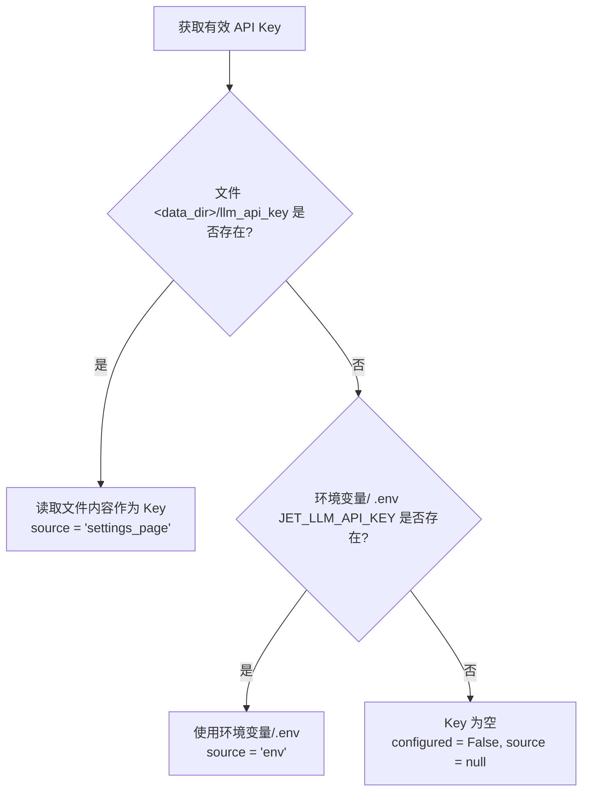
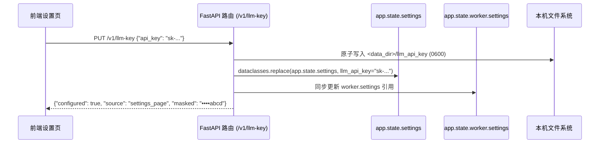

# Data Model: 给朋友安装的两个入口（API Key 设置与安装契约）

**Feature**: `007-friend-install`
**Date**: 2026-09-29
**Branch**: `007-friend-install`

---

## 1. 实体与存储模型

### 1.1 本机独立凭据文件 (`llm_api_key`)

API Key 作为求职者的私有外发凭据，**坚决不进数据库、不进代码仓库、不进日志**。

| 属性 | 说明 |
|---|---|
| **路径** | `<data_dir>/llm_api_key`（例如 `~/Library/Application Support/Jet/llm_api_key`） |
| **编码与格式** | UTF-8 单行文本，保存前后自动 `strip()` 去除首尾空白 |
| **文件权限** | `0600`（仅当前系统用户可读写，`rw-------`） |
| **写入机制** | 原子替换（原子写入：在 `<data_dir>` 下生成临时文件 `llm_api_key.tmp.<rand>` 并写入，设置权限 `0600`，调用 `os.replace` 原子重命名至目标路径） |
| **删除机制** | `os.unlink(..., missing_ok=True)` 物理删除 |

---

### 1.2 内存配置模型 (`Settings` 与热更新)

`Settings` 在后端维持只读不可变设计，通过实例替换实现无锁热更新。

```python
# Settings 对象属性关系
@dataclass(frozen=True)
class Settings:
    data_dir: Path
    port: int = 47615
    llm_base_url: str = "https://api.deepseek.com"
    llm_model: str = "deepseek-flash"
    llm_api_key: str | None = None
    ...
```

#### 来源优先级判定



#### 运行时状态同步

当用户在插件设置页保存或清除 Key 时：


---

## 2. API 数据传输对象 (DTO)

### 2.1 API Key 信息对象 (`LlmKeyInfo`)

用于 `GET /v1/llm-key`、`PUT /v1/llm-key`、`DELETE /v1/llm-key` 的返回结构。

| 字段 | 类型 | 可空 | 说明 | 示例 |
|---|---|---|---|---|
| `configured` | `boolean` | 否 | 当前服务端是否已配置可用的 API Key | `true` |
| `source` | `string` | 是 | Key 的来源，枚举：`"settings_page"`, `"env"`, 或 `null` | `"settings_page"` |
| `masked` | `string` | 是 | 脱敏展示值（仅展示后 4 位，其余统一打码；未配置为 null） | `"••••abcd"` |

> **打码规则**：
> 若有效 Key 为 `sk-1234567890abcdef`，后 4 位为 `cdef`，返回 `••••cdef`。
> 若 Key 长度不足 4 位，返回 `••••<完整Key>`。
> 绝对不在返回体中暴露前缀或中间字符。

### 2.2 测试连接传输对象

#### 请求：`POST /v1/llm-key/test`
| 字段 | 类型 | 必填 | 说明 |
|---|---|---|---|
| `api_key` | `string` | 否 | 待测试的 Key。若不传或为 `null`/空字符串，服务端自动测试当前已生效的 Key |

#### 响应：
| 字段 | 类型 | 说明 | 枚举值 |
|---|---|---|---|
| `ok` | `boolean` | 测试是否成功连接并鉴权成功 | `true`, `false` |
| `reason` | `string` | 状态原因代码 | `"ok"`: 连接成功<br/>`"invalid_key"`: 401/403 鉴权失败<br/>`"unreachable"`: 网络超时或不可达<br/>`"no_key"`: 未传入且服务端亦未配置 |

### 2.3 系统状态对象 (`/v1/status` 增量)

| 字段 | 类型 | 说明 |
|---|---|---|
| `llm_key_configured` | `boolean` | 当前服务是否已配置 API Key（`settings_page` 或 `env` 任一具备即为 `true`） |

---

## 3. 前端视图状态与状态机流转

### 3.1 `VIEW_STATES` 新增枚举

在 `extension/src/view-state.js` 的 `VIEW_STATES` 数组中新增：

```javascript
export const VIEW_STATES = [
  ...
  "no_llm_key", // 新增：未配置 API Key
  ...
];

export const LABELS = {
  ...
  no_llm_key: "请先在设置页填写 DeepSeek API Key",
  ...
};
```

### 3.2 岗位判断触发与状态机矩阵

| 场景 | 当前条件 | 行为与输出 | 数据库变更 | 额度与模型调用 |
|---|---|---|---|---|
| 打开详情页 | 规则粗筛**未通过**（淘汰） | 返回淘汰结论 `skip`（标签「不建议投」） | 写入 `judgements` (`source='rule'`) | 0 调用，0 扣额 |
| 打开详情页 | 规则粗筛**通过**，但**未配置 Key** | 响应附带 `notice: "no_llm_key"`，卡片与侧边栏显示「请先在设置页填写 DeepSeek API Key」 | **不入库**任何 judgement | 0 调用，0 扣额 |
| 打开详情页 | 规则粗筛**通过**，**已配置 Key** | 正常进入排队，卡片显示「判断中」 | 写入 `judgements` (`status='queued'`) 并提交 worker | 正常排队判断 |
| 补填 Key 后再打开之前未判岗位 | 曾因无 Key 未判，已配好 Key | 正常进入排队（因之前未产生 failed 记录） | 写入 `judgements` (`status='queued'`) 并提交 worker | 正常判断 |
| 手动点"重新判断" | **未配置 Key** | 接口直接拒绝，返回 409 `no_llm_key`，前端提示填写 Key | 无修改 | 0 调用，0 扣额 |
| 聊天页点"生成建议" | **未配置 Key** | 接口直接拒绝，返回 409 `no_llm_key`，前端提示填写 Key | 无修改 | 0 调用，0 扣额 |

---

## 4. 安装脚本数据契约

### 4.1 LaunchAgent Plist 结构实体 (`local.jet.serve.plist`)

```xml
<?xml version="1.0" encoding="UTF-8"?>
<!DOCTYPE plist PUBLIC "-//Apple//DTD PLIST 1.0//EN" "http://www.apple.com/DTDs/PropertyList-1.0.dtd">
<plist version="1.0">
<dict>
    <key>Label</key>
    <string>local.jet.serve</string>
    <key>ProgramArguments</key>
    <array>
        <string>${UV_BIN}</string>
        <string>run</string>
        <string>--frozen</string>
        <string>jet</string>
        <string>serve</string>
    </array>
    <key>WorkingDirectory</key>
    <string>${PROJECT_ROOT}</string>
    <key>EnvironmentVariables</key>
    <dict>
        <key>PATH</key>
        <string>${UV_DIR}:/usr/local/bin:/opt/homebrew/bin:/usr/bin:/bin</string>
    </dict>
    <key>RunAtLoad</key>
    <true/>
    <key>KeepAlive</key>
    <dict>
        <key>SuccessfulExit</key>
        <false/>
    </dict>
    <key>ThrottleInterval</key>
    <integer>10</integer>
    <key>StandardOutPath</key>
    <string>${HOME}/Library/Logs/jet/serve.log</string>
    <key>StandardErrorPath</key>
    <string>${HOME}/Library/Logs/jet/serve.log</string>
</dict>
</plist>
```
