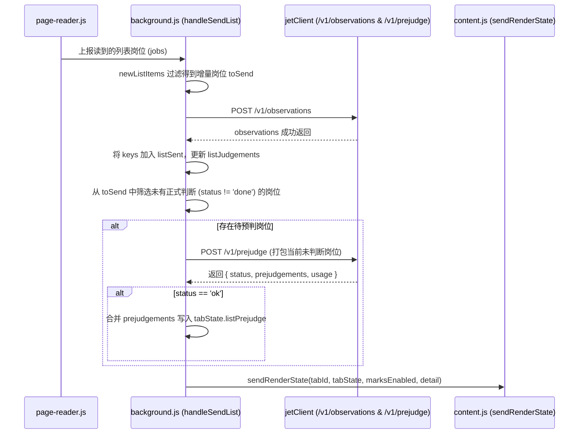

# Plugin Protocol & View Contracts: 插件内部通信与标记规范 (008-list-prejudge)

**Feature**: `008-list-prejudge`
**Scope**: 浏览器插件内部组件间（`page-reader.js`、`background.js`、`page-summary.js`、`content.js`、`marks-layout.js`）数据交换与视图契约。

---

## 1. 列表数据抓取结构 (`page-reader.js`)

在 `page-reader.js` 的 `readBossPage()` 中，从页面 Vue 实例提取列表项时新增 `experience` 与 `degree` 字段，其余字段保持原样。

### 岗位对象结构 (Job Item)

```javascript
{
  platform_job_id: String(item.encryptJobId),
  title: String(item.jobName),
  company_name: item.brandName ? String(item.brandName).trim() : null,
  company_industry: item.brandIndustry ? String(item.brandIndustry).trim() : null,
  salary_raw: item.salaryDesc ? String(item.salaryDesc) : null,
  city: item.cityName ? String(item.cityName) : "",
  district: item.areaDistrict ? String(item.areaDistrict).trim() : null,
  experience: item.jobExperience ? String(item.jobExperience).trim() : null, // 新增：经验要求
  degree: item.jobDegree ? String(item.jobDegree).trim() : null,             // 新增：学历要求
  job_labels: cleanStringArray(item.jobLabels),
  skills: cleanStringArray(item.skills)
}
```

- **数据源约束**：只读当前页面已加载的 Vue 数据对象属性（`item.jobExperience` 与 `item.jobDegree`），严禁发起网络请求或触发 DOM 模拟点击。

---

## 2. 后台状态维护与调度协议 (`background.js`)

### 2.1 Tab 状态扩展

`tabStateMap` 中每个活动标签页对应的 `tabState` 对象新增 `listPrejudge` Map：

```javascript
tabState.listPrejudge = new Map();
// Key: platform_job_id (string)
// Value: {
//   level: "open" | "neutral" | "skip",
//   reason: string,
//   created_at: string
// }
```

### 2.2 列表触发与预判编排时序 (`handleSendList`)



- **缓存清理策略**：用户在设置页点击"保存画像"（`handleSaveProfile` 触发）时，`background.js` 必须同步清空 `tabState.listSent` 和 `tabState.listPrejudge`，使已浏览岗位在新画像下可重新获得最新预判。

---

## 3. 标记数据结构与计算规范 (`page-summary.js`)

### 3.1 `buildListMarks` 签名与优先级规则

```javascript
export function buildListMarks(listJudgements, listPrejudge)
```

**优先级判定链条（四级阶梯）**：

| 优先级 | 条件 | 渲染类型 | 视觉呈现 |
|---|---|---|---|
| **1 (最高)** | `judgement && judgement.status === "done" && verdict` | 正式判断标记 | 实线色条 + 实心背景标签 |
| **2** | `listPrejudge.has(jobId)` | 预判标记 (`type: "prejudge"`) | 虚线/半透明色条 + 空心描边标签 + tooltip 理由 |
| **3** | `screen_hints && screen_hints.length > 0` | 粗筛提示 (`type: "hint"`) | 灰色实线色条 + 灰底小字标签 |
| **4** | `hasStatus` (仅投递状态) | 状态徽标 | 无色条 + 状态徽标 |

### 3.2 预判标记数据对象 (Mark Object Schema)

当命中第 2 优先级（预判）时，生成的 Mark 对象规范：

```javascript
{
  type: "prejudge",
  is_prejudge: true,
  verdict_label: "预判·值得点开" | "预判·一般" | "预判·可跳过",
  verdict_tone: "open" | "neutral" | "skip",
  reason: string,             // 预判理由，用于 tooltip
  stale: false,
  judged_at: null,
  // 若同时带有投递状态字段（my_status）：
  status_key: "saved" | "applied" | "skipped" | null,
  status_label: "收藏" | "已投递" | "不考虑" | null,
  status_tone: "saved" | "applied" | "skipped" | null
}
```

#### 文案与色彩映射表：

| `level` | `verdict_label` | `verdict_tone` | 对应主题色 (Tone Color) | 语义 |
|---|---|---|---|---|
| `open` | `"预判·值得点开"` | `"open"` | 绿色 (`#10b981` / green) | 强烈匹配，建议深入查看 |
| `neutral` | `"预判·一般"` | `"neutral"` | 灰石板色 (`#64748b` / slate) | 部分匹配或信息模糊 |
| `skip` | `"预判·可跳过"` | `"skip"` | 橙色/琥珀色 (`#f59e0b` / amber) | 关键条件不符，建议跳过 |

---

## 4. 视图层渲染与布局契约 (`content.js` & `marks-layout.js`)

`content.js`（经典脚本）与 `marks-layout.js`（ESM 模块）必须保持算法与样式逻辑完全同步。

### 4.1 侧边色条样式 (Strip Element)

```javascript
if (item.stale) {
  stripEl.style.borderLeft = item.strip.width + "px dashed " + toneColor;
  stripEl.style.background = "transparent";
  stripEl.style.opacity = "0.55";
} else if (item.is_prejudge) {
  // 预判色条：虚线样式 + 半透明
  stripEl.style.borderLeft = item.strip.width + "px dashed " + toneColor;
  stripEl.style.background = "transparent";
  stripEl.style.opacity = "0.75";
} else {
  // 正式判断色条：实心填充
  stripEl.style.background = toneColor;
  stripEl.style.opacity = "1";
}
```

### 4.2 标签样式 (Label Element)

- **正式判断标签**：
  实心背景、白色或对比文字，文字为"建议投递"、"可以试试"等。
- **预判标签**：
  - CSS 类名：`jet-mark-label prejudge <toneCls>`；
  - 样式规范：
    - `background: rgba(255, 255, 255, 0.95);`（或空心透明）；
    - `border: 1px solid <toneColor>;`（空心描边）；
    - `color: <toneColor>;`（描边同色小字）；
    - `font-size: 11px;`；
    - `padding: 0 4px;`；
  - Tooltip：`labelEl.title = item.reason;`（鼠标悬停时原生展示大模型给出的一句简短理由）。

### 4.3 状态徽标协同 (Status Badge)

若该岗位在被预判的同时已有用户的投递状态（例如"已投递"、"收藏"）：
- 保持现有的 `computeStatusBadgeLayout` 布局计算，状态徽标紧跟在预判标签右侧（间距 4px），互不重叠。
