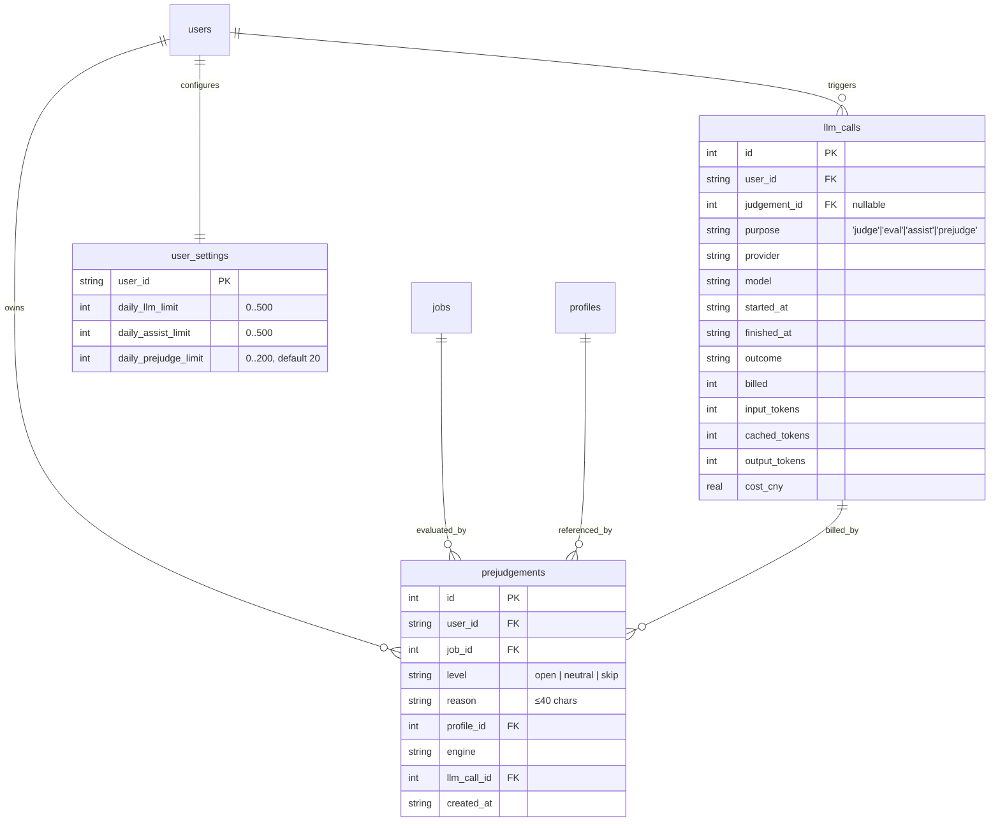
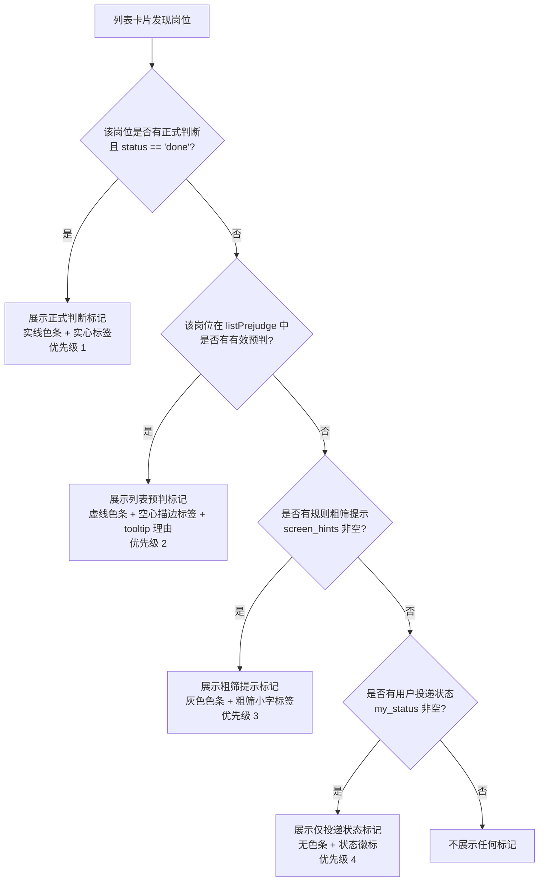
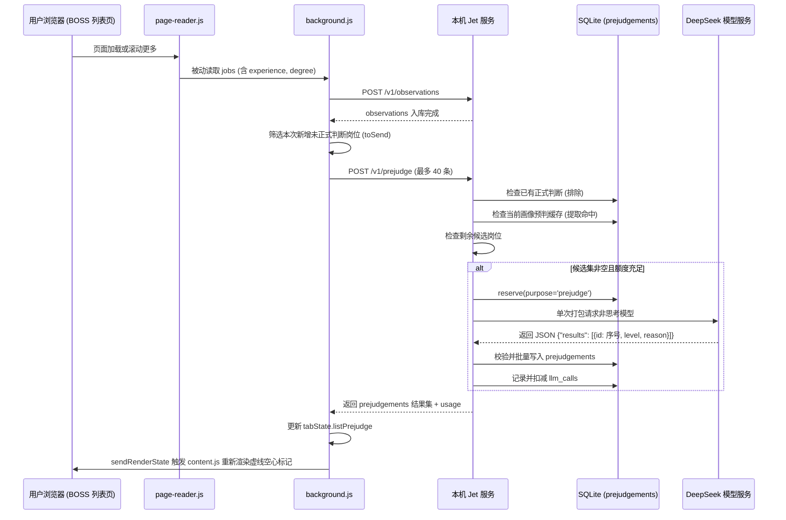

# Data Model: 列表页岗位大模型预判 (008-list-prejudge)

**Feature**: `008-list-prejudge`
**Date**: 2026-09-30
**Branch**: `008-list-prejudge`

---

## 1. 实体关系图 (ER Diagram)

列表预判数据与正式判断表（`judgements`）完全解耦，独立记录并按用户隔离。



> [!IMPORTANT]
> `prejudgements` 表与 `judgements` 表没有任何外键关联。列表预判绝不写入 `judgements` 表，两者生命周期互不影响。

---

## 2. 数据库存储模型 (SQLite Schema v8)

### 2.1 新建 `prejudgements` 表

用于持久化存储针对“仅列表信息”岗位的轻量大模型预判结果。

```sql
CREATE TABLE IF NOT EXISTS prejudgements (
    id INTEGER PRIMARY KEY AUTOINCREMENT,
    user_id TEXT NOT NULL,
    job_id INTEGER NOT NULL,
    level TEXT NOT NULL CHECK(level IN ('open', 'neutral', 'skip')),
    reason TEXT NOT NULL,
    profile_id INTEGER NOT NULL,
    engine TEXT,
    llm_call_id INTEGER,
    created_at TEXT NOT NULL,
    UNIQUE(user_id, job_id, profile_id),
    FOREIGN KEY (user_id) REFERENCES users(id),
    FOREIGN KEY (job_id) REFERENCES jobs(id),
    FOREIGN KEY (profile_id) REFERENCES profiles(id),
    FOREIGN KEY (llm_call_id) REFERENCES llm_calls(id)
);

CREATE INDEX IF NOT EXISTS idx_prejudgements_user_job ON prejudgements(user_id, job_id);
```

#### 字段说明与约束：
- `id`: 自增主键。
- `user_id`: 归属用户 ID（按用户数据隔离，默认 `'me'`）。
- `job_id`: 关联 `jobs.id`（必须是已入库岗位）。
- `level`: 预判三档档位，限制为 `'open'`（值得点开）、`'neutral'`（一般）、`'skip'`（可以跳过）。
- `reason`: 大模型生成的一句简要理由，服务端强制截断为最多 40 字符。
- `profile_id`: 产生该预判时所依据的画像版本 ID。当用户修改画像生成新版本后，旧版本的预判自动失效。
- `engine`: 调用的模型引擎标识（如 `deepseek-flash:no-think`）。
- `llm_call_id`: 关联的 `llm_calls.id`，用于审计与计费追溯。
- `created_at`: UTC ISO-8601 时间戳。
- `UNIQUE(user_id, job_id, profile_id)`: 确保同一用户在同一画像版本下对同一岗位仅存储一条预判记录。

---

### 2.2 `user_settings` 表新增列

扩展每日预判配额字段：

```sql
ALTER TABLE user_settings ADD COLUMN daily_prejudge_limit INTEGER NOT NULL DEFAULT 20 CHECK(daily_prejudge_limit BETWEEN 0 AND 200);
```

- 单位：**页**（即一次批量调用大模型的次数）。
- 默认值：`20` 页。
- 允许取值：`0` 至 `200` 整数。`0` 表示完全关闭预判功能。

---

### 2.3 `llm_calls` 表重建

修改 `purpose` 检查约束，扩展加入 `'prejudge'`：

```sql
CREATE TABLE llm_calls_new (
    id INTEGER PRIMARY KEY AUTOINCREMENT,
    user_id TEXT NOT NULL,
    judgement_id INTEGER,
    purpose TEXT NOT NULL DEFAULT 'judge' CHECK(purpose IN ('judge', 'eval', 'assist', 'prejudge')),
    eval_run_id TEXT,
    provider TEXT NOT NULL,
    model TEXT NOT NULL,
    started_at TEXT NOT NULL,
    finished_at TEXT,
    outcome TEXT NOT NULL,
    billed INTEGER NOT NULL,
    input_tokens INTEGER,
    cached_tokens INTEGER,
    output_tokens INTEGER,
    cost_cny REAL,
    FOREIGN KEY (user_id) REFERENCES users(id),
    FOREIGN KEY (judgement_id) REFERENCES judgements(id)
);

INSERT INTO llm_calls_new SELECT * FROM llm_calls;
DROP TABLE llm_calls;
ALTER TABLE llm_calls_new RENAME TO llm_calls;
```

---

## 3. 内存与数据传输模型 (Python DTOs)

### 3.1 预判接口数据结构 (`src/jet/api/routes.py`)

```python
from typing import Literal
from pydantic import BaseModel, Field

class PrejudgeJobItem(BaseModel):
    platform_job_id: str
    title: str
    company_name: str | None = None
    company_industry: str | None = None
    salary_raw: str | None = None
    city: str = ""
    district: str | None = None
    experience: str | None = None
    degree: str | None = None
    job_labels: list[str] = Field(default_factory=list)
    skills: list[str] = Field(default_factory=list)

class PrejudgeRequest(BaseModel):
    jobs: list[PrejudgeJobItem] = Field(..., max_length=40)

class PrejudgeItemResult(BaseModel):
    level: Literal["open", "neutral", "skip"]
    reason: str
    created_at: str

class PrejudgeUsage(BaseModel):
    used: int
    limit: int
    remaining: int

class PrejudgeResponse(BaseModel):
    status: Literal["ok", "quota_exhausted", "no_llm_key", "no_profile", "empty", "failed"]
    prejudgements: dict[str, PrejudgeItemResult] = Field(default_factory=dict)
    usage: PrejudgeUsage

class PrejudgeSettingsPayload(BaseModel):
    daily_prejudge_limit: int = Field(..., ge=0, le=200)

class PrejudgeSettingsResponse(BaseModel):
    daily_prejudge_limit: int
    used_today: int
    remaining_today: int
```

---

## 4. 浏览器插件运行时状态模型

### 4.1 Background 内存状态 (`tabState.listPrejudge`)

在 `extension/src/background.js` 中，每个 Tab 维护的 `tabState` 新增 `listPrejudge` Map：

```javascript
tabState.listPrejudge = new Map();
// 键：platform_job_id (string)
// 值：
// {
//   level: "open" | "neutral" | "skip",
//   reason: string,
//   created_at: string
// }
```

### 4.2 标记构建输出结构 (`page-summary.js:buildListMarks`)

```javascript
// 针对命中预判的岗位生成的 mark 对象
{
  type: "prejudge",
  is_prejudge: true,
  verdict_label: "预判·值得点开" | "预判·一般" | "预判·可跳过",
  verdict_tone: "open" | "neutral" | "skip",
  reason: "薪资与技术栈匹配，值得深入了解",
  stale: false,
  judged_at: null,
  status_key: "saved" | "applied" | "skipped" | null,
  status_label: "收藏" | "已投递" | "不考虑" | null,
  status_tone: "saved" | "applied" | "skipped" | null
}
```

---

## 5. 状态流转与展示优先级决策图

列表页卡片标记严格遵守四大优先级梯队：



### 预判数据流转周期


