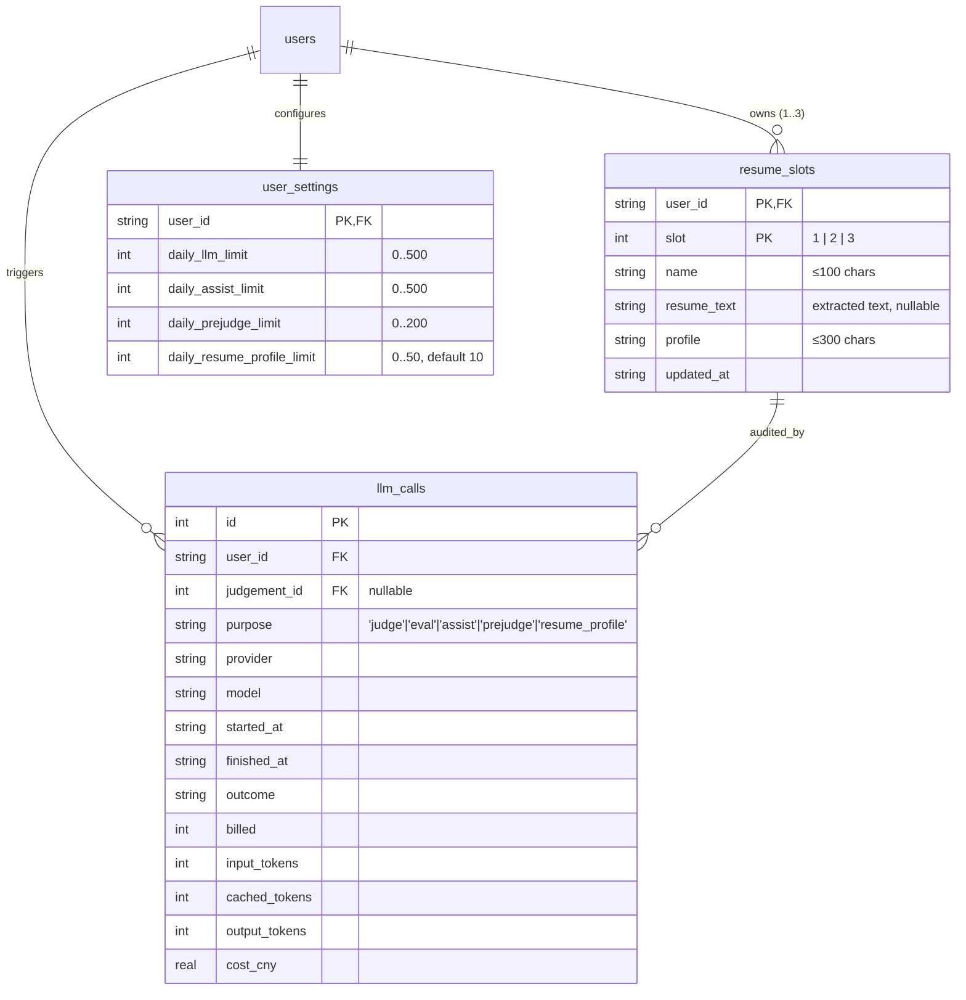
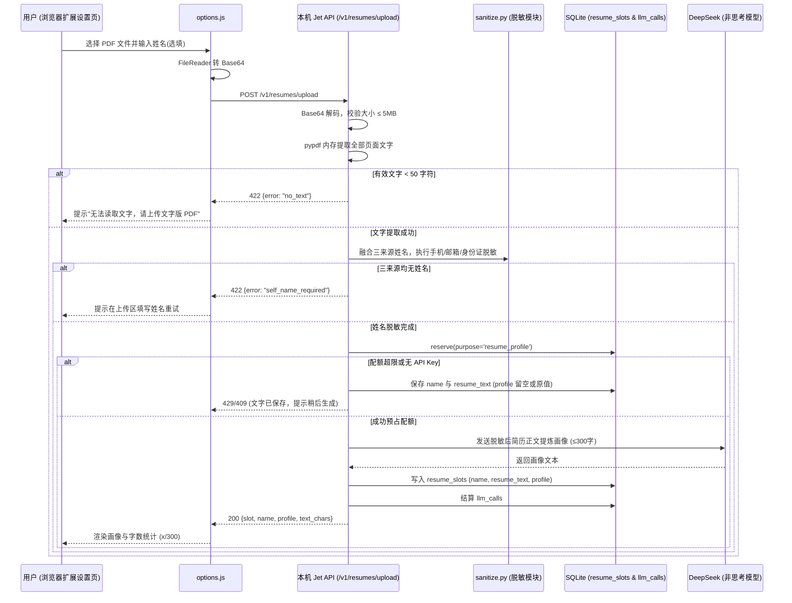
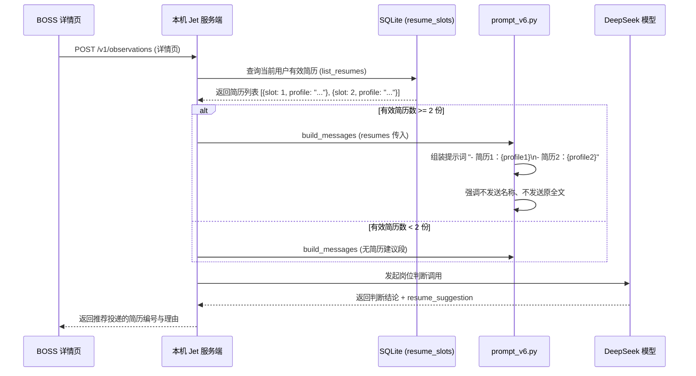

# Data Model: 我的简历：上传 PDF + AI 简历画像 (009-resume-pdf)

**Feature**: `009-resume-pdf`
**Date**: 2026-09-30
**Branch**: `009-resume-pdf`

---

## 1. 实体关系图 (ER Diagram)

简历槽位实体（`resume_slots`）属于用户个人数据，与 `users` 表严格关联，大模型生成画像的调用审计记录在 `llm_calls` 中，独立额度由 `user_settings` 约束。



> [!IMPORTANT]
> - `resume_slots` 严格按 `user_id` 隔离，不写入公共岗位库，其他用户不可见。
> - 系统中绝对不持久化 PDF 二进制字节，仅存储提取出的脱敏文本与生成的画像。

---

## 2. 数据库存储模型 (SQLite Schema v9)

### 2.1 重建 `resume_slots` 表

用于持久化存储每位用户的三份简历配置。旧版字段 `job_types` 迁移为 `profile`，新增字段 `resume_text` 存储提取出的脱敏源文本。

```sql
CREATE TABLE IF NOT EXISTS resume_slots (
    user_id TEXT NOT NULL,
    slot INTEGER NOT NULL CHECK(slot IN (1, 2, 3)),
    name TEXT NOT NULL CHECK(length(name) <= 100),
    resume_text TEXT,
    profile TEXT NOT NULL,  -- 300 字上限由代码截断与校验保证，建表语句没有 CHECK
    updated_at TEXT NOT NULL,
    PRIMARY KEY(user_id, slot),
    FOREIGN KEY (user_id) REFERENCES users(id)
);
```

#### 字段说明与约束：
- `user_id`: 归属用户 ID（外键引用 `users.id`）。
- `slot`: 简历编号（1、2 或 3），主键联合键。
- `name`: 简历自定义名称，非空，去空白后最多 100 字符；仅供前端展示与区分，绝不外发给大模型。
- `resume_text`: 从文字版 PDF 中提取并**已经脱敏**的文字（入库前完成脱敏，原文不保存）；重新生成画像时在它的基础上再脱敏一次。可为空（从 v8 迁移来的历史数据该字段为 NULL）（2026-10-06 体检第 58 条按实现修订）。
- `profile`: AI 生成或用户手动编辑的简历画像（适合岗位方向 + 核心亮点），非空，最多 300 字符（由代码保证，数据库无 CHECK 约束）；随岗位判断外发给大模型。
- `updated_at`: UTC ISO-8601 时间戳（如 `2026-09-30T02:00:00Z`）。

---

### 2.2 `user_settings` 表新增列

扩展简历画像生成的独立每日配额列：

```sql
ALTER TABLE user_settings ADD COLUMN daily_resume_profile_limit INTEGER NOT NULL DEFAULT 10 CHECK(daily_resume_profile_limit BETWEEN 0 AND 50);
```

- 单位：**次**（即调用大模型生成简历画像的成功计费次数）。
- 默认值：`10` 次。
- 允许取值：`0` 至 `50` 整数。
- 说明：受宪法原则 VII 约束，不在插件设置页对普通用户暴露，后台自动生效。

---

### 2.3 `llm_calls` 表重建

修改 `purpose` 检查约束，扩展加入 `'resume_profile'`：

```sql
CREATE TABLE llm_calls_new (
    id INTEGER PRIMARY KEY AUTOINCREMENT,
    user_id TEXT NOT NULL,
    judgement_id INTEGER,
    purpose TEXT NOT NULL DEFAULT 'judge' CHECK(purpose IN ('judge', 'eval', 'assist', 'prejudge', 'resume_profile')),
    eval_run_id TEXT,
    provider TEXT NOT NULL,
    model TEXT NOT NULL,
    started_at TEXT NOT NULL,
    finished_at TEXT,
    outcome TEXT NOT NULL,
    billed INTEGER NOT NULL,
    input_tokens INTEGER,
    cached_tokens INTEGER,
    output_tokens INTEGER,
    cost_cny REAL,
    FOREIGN KEY (user_id) REFERENCES users(id),
    FOREIGN KEY (judgement_id) REFERENCES judgements(id)
);

INSERT INTO llm_calls_new SELECT * FROM llm_calls;
DROP TABLE llm_calls;
ALTER TABLE llm_calls_new RENAME TO llm_calls;
```

---

## 3. 内存与数据传输模型 (Python DTOs)

### 3.1 简历上传与画像生成 DTO (`src/jet/api/routes.py`)

```python
from typing import Literal
from pydantic import BaseModel, Field

class ResumeUploadPayload(BaseModel):
    slot: Literal[1, 2, 3]
    name: str = Field(..., max_length=100)
    pdf_base64: str
    self_name: str | None = None

class ResumeUploadResponse(BaseModel):
    slot: Literal[1, 2, 3]
    name: str
    profile: str
    text_chars: int

class ResumeRegeneratePayload(BaseModel):
    self_name: str | None = None

class ResumeItemResponse(BaseModel):
    slot: Literal[1, 2, 3]
    name: str
    profile: str
    has_text: bool
    text_chars: int
    updated_at: str

# 实际实现没有 ResumeUpdateItem / ResumeUpdatePayload 模型（体检第 58 条修订）：
# PUT /v1/resumes 接收任意 JSON（routes.py `body: Any = Body(...)`），由 domain/resume.py save_resumes 手写校验：
# - 接受数组，或 {"items": [...]} / {"resumes": [...]}；最多 3 项，slot 为 1–3 且不重复；
# - name 去空白后非空且 ≤100 字；画像取 profile，没有时回退旧字段 job_types（插件目前两个字段都发）；画像非空且 ≤300 字。
```

---

## 4. 浏览器插件运行时数据模型

### 4.1 选项页数据表示 (`extension/src/options.js`)

在选项页内存中维护每份简历的展示状态：

```javascript
// 单份简历项内存表示
{
  slot: 1, // 1 | 2 | 3
  name: "后端开发-通用版",
  profile: "适合方向：Python/Go 后端架构与高并发服务开发。\n亮点：\n1. 具备大型分布式系统架构与微服务治理经验；\n2. 深入掌握 MySQL/Redis 调优与消息队列实践；\n3. 熟悉 Kubernetes 容器化部署与监控体系。",
  has_text: true,
  text_chars: 1420,
  updated_at: "2026-09-30T02:15:00Z"
}
```

### 4.2 上传暂存数据结构

当用户在文件控件中选中 PDF 时：
```javascript
{
  slot: 1,
  name: "张三_后端开发简历", // 默认去掉 .pdf 后缀，用户可编辑
  pdf_base64: "JVBERi0xLjQK...",
  self_name: "张三" // 来自可选输入框
}
```

---

## 5. 业务时序与状态流转

### 5.1 上传 PDF 提取文字并生成画像时序



### 5.2 岗位判断时简历建议组装流转


